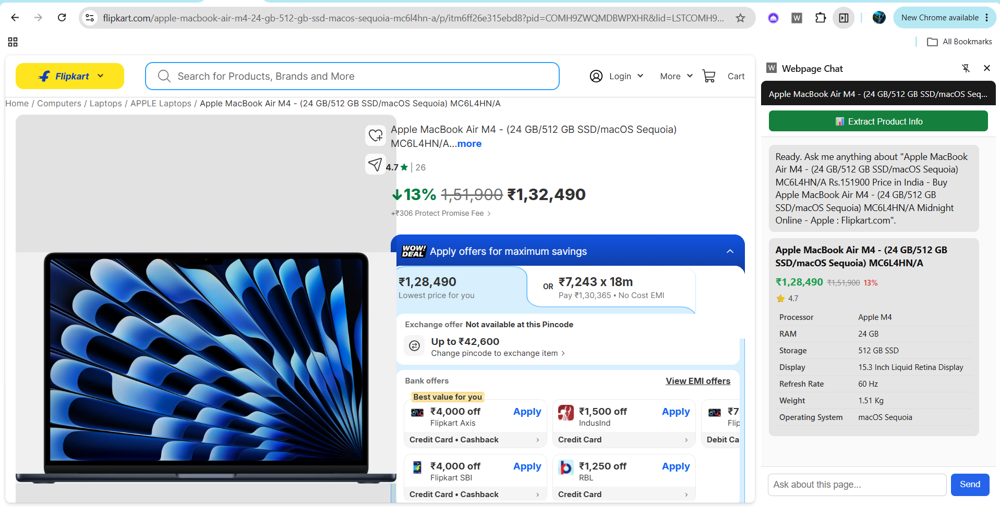

# Webpage Chat Assistant

A Chrome extension that lets you chat with any webpage in real time — ask questions about a product listing, article, or documentation page and get answers grounded in what's actually on the page, powered by an LLM backend.

**Example use case:** you're browsing a product on Amazon or Flipkart and don't want to read the entire listing. Open the side panel and ask "what's the price after offers?" or "what are the cons?" — get a direct answer instead of scanning the page yourself.

## Demo

<p align="center">
  
</p>


**Live backend:** `https://webpage-chat-backend.onrender.com` (Render free tier — the first
request after 15 minutes of inactivity takes 30-60s to wake up, then responds normally)

## How it works

1. A content script extracts clean text from whatever page you're viewing
2. That content is sent to a FastAPI backend, which holds it as context for the conversation
3. Questions you ask in the side panel are answered by an LLM (via Groq) using that page as grounding
4. Each browser tab keeps its own independent chat session — switching tabs shows that tab's conversation, not a mix of pages
5. As you navigate to different pages within the same tab, each page's content is added to that session's memory — you can ask about a page you looked at earlier without re-opening it

## Tech stack

- **Extension:** Chrome Manifest V3, Side Panel API, vanilla JS
- **Backend:** FastAPI (Python)
- **LLM orchestration:** LangChain (`ChatGroq`, `RunnableWithMessageHistory`, `InMemoryVectorStore`)
- **Embeddings:** Cohere API (hosted, free tier, no card required)
- **Inference:** Groq API (free tier)

## Project structure

```
webpage-chat-assistant/
├── backend/
│   ├── main.py            # FastAPI app: /ingest and /chat endpoints
│   ├── requirements.txt
│   └── .env.example
└── extension/
    ├── manifest.json       # MV3 config, side panel + permissions
    ├── background.js       # Service worker, relays page-load events per tab
    ├── content.js           # Extracts page text, responds to on-demand requests
    ├── sidepanel.html/.css/.js  # Chat UI, per-tab session state
    └── README.md
```

## Setup

The extension already points at the live backend above, so you only need to load it —
no local backend required unless you want to modify and test the backend yourself.

### Just want to try the extension?
1. Clone the repo (or download the `extension/` folder)
2. Open `chrome://extensions`, enable Developer mode
3. "Load unpacked" → select the `extension` folder
4. Pin the extension icon, open any website, and start asking questions

### Want to run the backend locally too?
```bash
cd backend
python -m venv venv
source venv/bin/activate      # Windows: venv\Scripts\activate
pip install -r requirements.txt
cp .env.example .env
# paste your free Groq key (console.groq.com) into .env
uvicorn main:app --reload --port 8000
```
Verify at `http://localhost:8000/health`, then change `BACKEND_URL` in
`extension/sidepanel.js` to `http://localhost:8000` and reload the extension.

### Deploying your own backend
This repo includes a `render.yaml` — connect the repo on [Render](https://render.com)
as a Blueprint, add `GROQ_API_KEY` and `COHERE_API_KEY` as environment variables when
prompted, and it deploys with no manual config. Python version is pinned via
`backend/.python-version` (3.11) since `pydantic-core` has no prebuilt wheel for newer
versions yet, which will otherwise fail the build trying to compile from source.

## Structured extraction (Phase 3)

Beyond free-form chat, there's a dedicated "Extract Product Info" button that returns
typed, structured data instead of a text answer — price, discount, rating, a spec table,
pros/cons — rendered as a proper card rather than parsed out of markdown.

This uses LangChain's `with_structured_output()` bound to a Pydantic schema (`ProductInfo`),
so the model is constrained to return valid typed data via tool calling, rather than us
regex-parsing a text response. Runs on a separate `ChatGroq` instance with more output
tokens and temperature 0, since structured extraction needs room for full spec lists and
benefits from determinism more than chat does.

## Multi-page memory (Phase 4)

The conversation isn't limited to a single page anymore. As you navigate to different
pages in the same tab, each page's content joins that session's memory instead of
replacing it — you can ask a question about a page you looked at five clicks ago.

Every visited page under ~6000 characters is kept in full and injected directly into
the prompt, source-tagged by page title/URL, so the model always has clean, complete
data per page rather than fragments. Pages longer than that fall back to chunking +
embeddings (`RecursiveCharacterTextSplitter` + Cohere + `InMemoryVectorStore`) with
similarity search against the question — real RAG, but only where it's actually needed,
since chunking a short structured page (a product spec table) turned out to fragment
it and cause wrong answers rather than help.

The current page's excerpt is placed last in the context block, closest to the actual
question, not first — this measurably reduced the model conflating "current product"
with whatever was named most recently in conversation text, which is a documented
attention/recency effect in transformer models, not just a data problem.

A follow-up question like "how's this better than the previous one?" gets rewritten
into a standalone question using chat history before retrieval runs, since vague
follow-ups barely resemble the actual page content and were causing weak, sometimes
hallucinated retrieval matches.

To stay under Groq's free-tier rate limit (8000 tokens/minute), both chat history
(capped to the last 4 turns) and total page context (capped at 6000 characters
combined across all pages, not just per-page) are hard-bounded — long sessions
gradually "forget" the earliest exchanges rather than growing the prompt forever.

**Embeddings provider — a real debugging story worth knowing:** this started on a
local ONNX model (FastEmbed), which caused repeated out-of-memory crashes on Render's
512MB free tier once any long page triggered it. Swapped to Google's hosted Gemini
embeddings to remove the local memory cost — but Google's API returned a permission
error because the free tier now requires a billing account attached, even for
free-quota usage. Settled on Cohere's embeddings API, which has a genuine free tier
(1,000 calls/month) with no card required, and is hosted, so it costs us nothing in
local memory either way.

## Design decisions worth knowing about

- **Side panel, not a popup that force-opens on every page.** Chrome doesn't allow extensions to auto-launch UI without a user gesture (anti-spam policy). Once you open the panel, it persists across tab navigation, which gets close to "always available" without violating that.
- **Per-tab session isolation.** Early versions had a bug where chatting about a MacBook listing in one tab would get contaminated by content from a different page opened in another tab. Fixed by tracking chat history and page context per `tabId` in the side panel, rather than relying on broadcast messages alone.
- **Page facts vs. general knowledge, clearly separated.** The model grounds answers in actual page content first. For opinion-style questions (e.g. "is this good for gaming," "what are the cons") it will only infer beyond the page when the excerpts genuinely support it, and always flags inference explicitly rather than blending it with page facts — deliberately erring conservative (declining rather than guessing) after earlier testing showed inferred content occasionally reading as fact.
- **Cohere for embeddings, not a local model.** Originally used a local ONNX model, which caused real OOM crashes on the deployed instance (see the Phase 4 section below). Hosted embeddings avoid that entirely — the trade-off is a monthly call quota instead of a memory ceiling.

## Deployment (Phase 5)

Backend runs on Render's free tier via the included `render.yaml` blueprint. CORS is
scoped to `chrome-extension://*` origins only (not wide open), since this is now a
public-facing service rather than local-only. The main gotcha worth knowing: Render's
free web services spin down after 15 minutes idle, so the first request after that
has a genuine 30-60s cold start — the extension doesn't currently show a loading
indicator for this specific case, so it can look stuck rather than slow.

## Roadmap

- [x] **Phase 1–2:** Core chat loop — extract page content, chat via Groq, side panel UI
- [x] Per-tab session isolation
- [x] LangChain refactor (`ChatGroq`, `RunnableWithMessageHistory`)
- [x] **Phase 3:** Structured extraction mode — auto-generate a price/spec/review card for product pages (`with_structured_output` + Pydantic schema) instead of free-form Q&A
- [x] **Phase 4:** Multi-page memory — full-page context per visited page, chunking + embeddings + vector store as fallback for long pages, query rewriting before retrieval
- [x] **Phase 5:** Deployment — backend live on Render, extension points at production URL

## Known limitations

- Chat history and page memory live in server RAM only — a Render free-tier spin-down/restart clears all active sessions (would need Postgres/Redis to persist across restarts)
- Sessions are evicted after 30 minutes idle or when more than 20 are active at once, to keep memory bounded on the free tier — this fixed a real OOM crash found during testing, caused by sessions accumulating with no cleanup
- Chat history is capped to the last 4 turns and total page context to 6000 characters combined, to stay under Groq's free-tier 8000 tokens/minute limit — long conversations gradually lose their earliest exchanges rather than the request growing unbounded
- Cohere's free embeddings tier is 1,000 calls/month — each call embeds a whole page's chunks at once, so this covers roughly 1,000 long-page visits/month, generous for personal use but a real ceiling under heavier use
- Structured extraction is tuned for shopping/product pages — other page types will mostly return `is_product_page: false`
- Asked directly for cons/downsides not stated on a page, the model now declines rather than inferring likely ones — a deliberate conservative choice (see Design decisions above) over a more helpful-but-riskier alternative
- No loading indicator for the Render cold-start delay specifically — a slow first response can look like a hang
- Extension isn't published to the Chrome Web Store — load-unpacked only, since publishing requires a one-time $5 developer fee and review process out of scope for this project